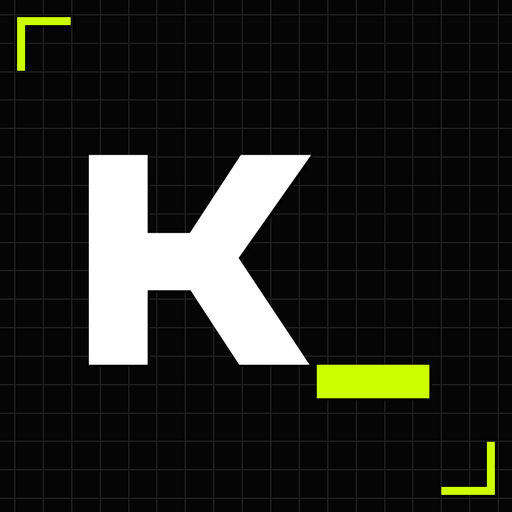

  <h1>Aerko_</h1>

  

 The most advanced fitness web app in history.

---

Aerko_ is a web application designed to be installed natively as a PWA. It combines advanced nutrition tracking, progressive overload training, and biomechanical analysis via computer vision. It was built with an obsessive focus on local-first privacy, extreme performance, and a brutalist usability standard. 

The goal was simple: replace three different types of monthly-subscription CRUD apps with a single, standalone, zero-cloud environment. 

### Index
* [1. Design Philosophy & UX](#1-design-philosophy--ux)
* [2. Core Engine & Modules](#2-core-engine--modules)
* [3. Languages & Personalities](#3-languages--personalities)
* [4. Privacy & Security](#4-privacy--security)
* [5. Architecture & Tech Stack](#5-architecture--tech-stack)
* [6. The Role of AI in Development](#6-the-role-of-ai-in-development)
* [7. Roadmap](#7-roadmap)

---

## 1. Design Philosophy & UX

> **System Warning:** I am primarily a Product Designer. This project started as my Master's Thesis (TFM) and was forged through Design Thinking and usability testing with Reddit communities. This isn't a sanitized corporate README. I'm going to break down the strict UX rules, the brutalist UI decisions, and the local-first architecture that make Aerko_ work.

### UI: Brutalism & Hierarchy
The interface relies on neo-brutalism and a cyberpunk/IDE aesthetic. I am fully aware it won't be to everyone's taste, but it is built strictly for high-contrast visibility and speed.

* **Color Palette (60-30-10):** Soft Black (`#1A1A1A`) background, White (`#FFFFFF`) for text, and Acid Green (`#CCFF00`) as the accent.
* **Typography:** **JetBrains Mono** combined with **Clash Display** (with Space Grotesk as a fallback). These fonts formalize the visual hierarchy using the perfect fourth as a scale and prevent number-reading fatigue.

### UX: Efficiency & Fitts's Law
The app is visually intimidating but technically idiot-proof. It prioritizes Jakob Nielsen's efficiency component.

* **Custom Anti-Shake Keyboard:** Designed for the harsh reality of lifting. When your CNS is fried after a heavy set of squats, you don't have the fine motor skills for tiny, native numeric inputs. The touch targets are massive by design and feature custom anti-shake logic to prevent double-logging inputs in a matter of milliseconds. 
* **Transversal Data:** Everything is interconnected. Log a new weight? The diet recalculates. Log a set? The app suggests the optimal weight for the next session based on your mesocycle's goal, fatigue patterns, and historical failures. Put in the effort once, and let the engine do the rest.

---

## 2. Core Engine & Modules

### 🍎 Nutrition
* **Base Calculators:** Uses the classic 1984 Harris-Benedict formula (I like retro) with macro ratios based on ISSN scientific standards. Or, you can use God Mode and input everything manually.
* **Local Pantry & Barcode Scanner:** A local database of +340 foods built from BEDCA and USDA data, combined with a native integration of the Open Food Facts API (via HTML5-QRCode) for zero-friction barcode scanning.
* **Modular Smart Checks:** Based on Pareto's law. You configure your base diet (fixed weights like 600g of chicken, or variable weights daily). Then, daily tracking is reduced to checking off accordions in record speed. Meals also hook into the *Notification Triggers API*.

### 🏋️ Training
* **Volume Analysis:** Cross-references your effective sets (filtering out warm-ups) with an anatomical database to map your exact volume thresholds (MV, MEV, MAV, or MRV). It features an Imbalance Detector that analyzes muscle head volume to warn you if you have structural blind spots.
* **Adaptive 1RM Calculator:** A dynamic engine that switches formulas based on reps: Brzycki (under 5 reps), Epley (6-10 reps), and Lombardi (11+ reps).

#### 🦾 MediaPipe & The Phantom DOM (The Crown Jewel)
Analyzing biomechanics (Squat, Bench Press, Deadlift) locally on a mobile browser is usually a performance nightmare. Processing 1080p 60fps video via MediaPipe melts batteries and freezes the main thread. So, I built a workaround:

1. **The Phantom DOM:** MediaPipe *demands* DOM access to function, which makes Web Worker implementation hell. To trick the model, I built a "Phantom DOM" inside the worker environment. It tames the library without main-thread blocking.
2. **Frame Traffic Controller:** Processing 1080p60 is unnecessary. The video is downscaled (720p/480p) and dropped to 15-30fps via a Ping-Pong traffic controller logic (sends a frame, waits for the `"FRAME_DONE"` signal).
3. **Math Interpolation & EMA:** To prevent a choppy 15fps output on the UI, coordinates are mathematically interpolated on the main thread, and an Exponential Moving Average (EMA) filter is applied to smooth the tracking. 

**Benchmarks (5 identical video passes):** 
* *Heavy Model:* 87-94% accuracy.
* *Full Model:* Slightly faster, less accurate.
* *Lite Model:* 59-71% accuracy (fast, but mathematically unreliable for serious lifting).

### 📈 Progress
* **Scientific Fat Calculator:** Input skinfold caliper data, and the app calculates body density using the Jackson-Pollock 3/7 formula alongside Siri's equation.
* **Anti-Obsession Cooldown:** A dynamic cooldown (20 hours for normal modes, 1 week for Zen mode) on biometric logging to prevent eating disorder behaviors and obsessive checking.

---

## 3. Languages and Personalities

The `i18n.service.js` engine dynamically loads translation fragments based on the exact screen you are on. The app features 3 modes:

* **Default:** Classic tracking (Spanish, English, Portuguese, German, French).
* **Zen:** Focuses on mental health, removes visual penalties, and extends cooldowns to avoid EDs.
* **Tsundere:** Maximum hostility, dark humor, and constant humiliation if you miss your goals.

*Note on Fallback Logic: Zen and Tsundere are only translated in Spanish. I refused to run dark humor through an AI translator, as contextless jokes ruin the UX. However, the fallback system is smart: if you set the app to English and enable Zen mode, it won't break; it simply loads the Default English strings over the Zen UX.*

---

## 4. Privacy & Security

This app has zero cloud integration. Everything lives in your browser via `IndexedDB`. To make this safe, I implemented military-grade cryptography using standard browser APIs:

* **Native Cryptography:** AES-GCM 256-bit via the native `window.crypto.subtle` API.
* **Key Derivation (PBKDF2):** A 4-digit PIN is weak. Aerko_ pushes it through PBKDF2 with 100,000 iterations combined with a locally generated salt to forge the master key.
* **Volatile RAM Isolation:** The master key never touches the disk. It exists only in volatile memory while the session is active. Close the tab, and it acts like an `rm -- "$0"`.
* **The Auth Canary:** To verify the PIN without exposing real user data to a failed decryption attempt, the app decrypts a small package containing the string `'AERKO_SECURE'`.
* **Segmented Vaults:** Data is divided into encrypted DB stores (`user_vault`, `nutrition_vault`, `training_vault`, `progress_vault`), with a public store for basic non-sensitive config.
* **Data Portability:** Parsers allow data imports from Hevy, Strong, Lifta, Apple Health, Google Fit, etc. Exports generate a `.json` decrypted directly in RAM. Zero vendor lock-in.

---

## 5. Architecture & Tech Stack

I hate heavy frameworks. You won't find a `node_modules` black hole or a React setup here. This is built for absolute performance.

* **Vanilla JS:** Zero framework overhead.
* **Native Web Components:** Entire UI built extending `HTMLElement` via `customElements.define`, using a mix of Shadow and Light DOM.
* **Pure CSS:** No Tailwind or Bootstrap. Custom CSS with native variables.
* **Native DB:** IndexedDB with a custom async wrapper to avoid promise hell.

**Key Libraries (Only the essentials):**
* **MediaPipe Vision (`vision_bundle.js`)**
* **Chart.js** (for biomechanical radars and dual-axis charts)
* **HTML5-QRCode** (Because native barcode Web APIs are years away from stable iOS support)
* **JSZip** (For local backup compression)
* **SortableJS** (Drag & drop physics)

*(P.S. If you read the source code, you'll find internal comments and Easter Eggs about my life. Consider it open-source lore).*

---

## 6. The Role of AI in Development

I am going to be completely transparent. As a Product Designer, I handled the UX/UI, the architecture, the CSS, the Web Crypto implementation, and the MediaPipe Phantom DOM logic.

However, **85-90% of the standard JS logic was written by AI** (Gemini 3.0 Pro, and later 3.1 Pro). 

I didn't use lazy prompts like "make me a fitness app." I acted as the software architect, providing the model with strict, modular technical constraints for every component. AI is the only reason I didn't need to spend thousands of euros on a dev team or spend 2 years hand-coding standard CRUD operations. The CSS required manual intervention to match Figma, but the logic holds up.

---

## 7. Roadmap

I plan to rewrite parts of the codebase from scratch when Gemini 3.2/3.3 drops, just to clean up the architecture further. Future plans include:

* **Cardio & Endurance:** Currently, the app is 100% hypertrophy-focused.
* **Desktop-First Analysis (RTPose):** Utilizing heavier models that don't fit on mobile web for extreme biomechanical precision.
* **Extreme Modularity:** The ability to install *only* the Nutrition DB or *only* the Training module to save local storage.
* **Optional Cloudflare Sync:** An opt-in cloud for those who don't want strict IndexedDB isolation.
* **Quality of Life:** PPL preset routines, up to 3 custom stopwatches, and a real end-of-year "Wrapped".

### Acknowledgments
Massive thanks to **OpenFoodFacts**, **USDA**, and **BEDCA** for the DBs, **Google MediaPipe** for the vision models, and the maintainers of Chart.js, HTML5-QRCode, JSZip, and SortableJS.
